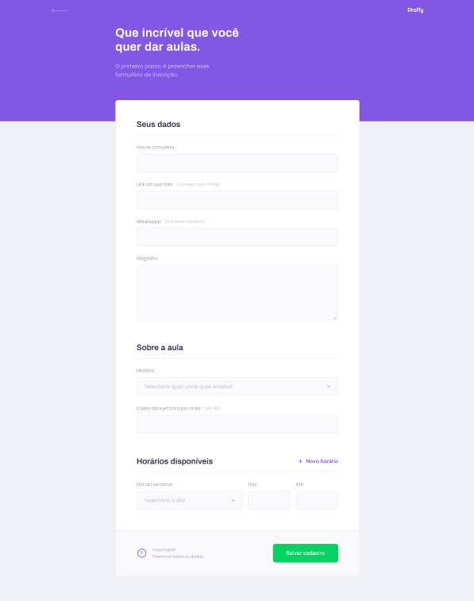
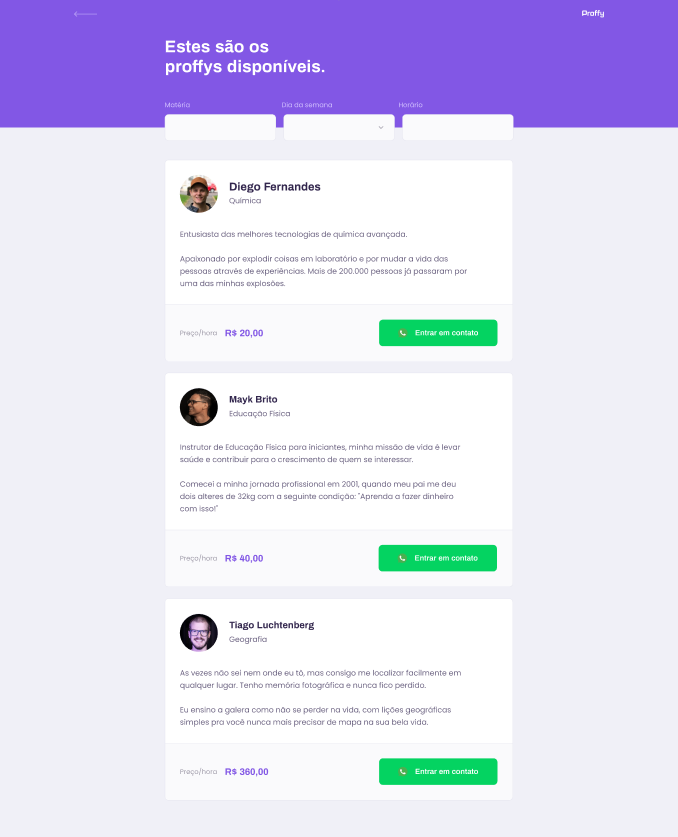

---

<a href='#nlw'>NLW </a>|
<a href='#proffy'>Proffy </a>|
<a href='#functionalities'>Functionalities </a>|
<a href='#days'>Days </a>|
<a href='#tecnologies'>Technologies </a>|
<a href='#layout'>Layout </a>|

## 
🚀 NLW 

Next Level Week is an intense week with the purpose of developing a real world application provided by RocketSeat, in this edition Proffy was developed.

---

## 
📚 Proffy 

Proffy is an online study platform, aiming to connect students and teachers with the objective of taking classes online.

---

## 
 ⚙ Functionalities 

1. Schedule of classes.
2. The student can contact a specific teacher.
3. Lists of teachers available.
4. Registration field, for teachers.

---

## 
📅 Days 

#### 1. ✅ Accelerating your evolution </li>

#### 2. ✅ Looking at opportunities </li>

#### 3. ✅ The choice of stack </li>

#### 4. ✅ Up to 2 years in 2 months </li>

#### 5. 🚧 The extra mile </li>

---

## 
💻 Technologies 

<a href='https://pt-br.reactjs.org/'>React</a>
 
<a href='https://www.typescriptlang.org/'>TypeScript</a>
 
<a href='https://nodejs.org/en/download/'>Node.js</a>
 
<a href='https://reactnative.dev/'>React Native</a>
 

---

## 
🎨 Layout 

